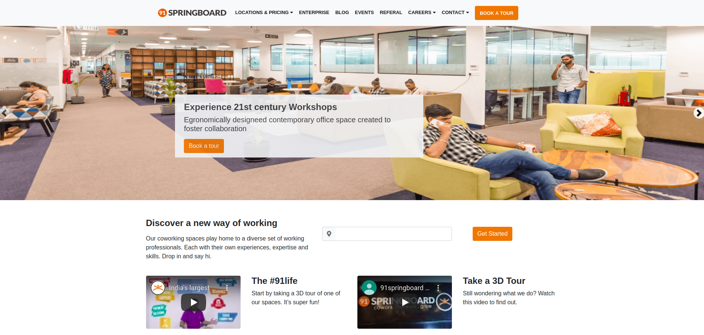
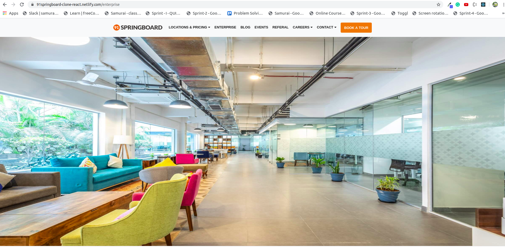
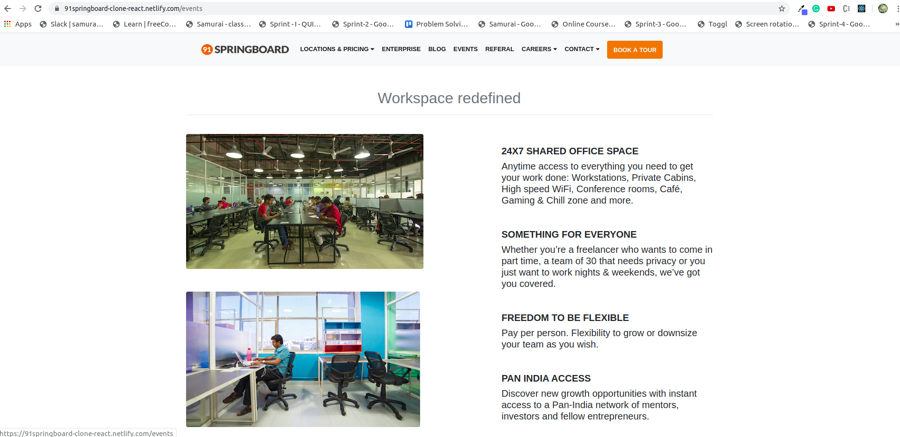
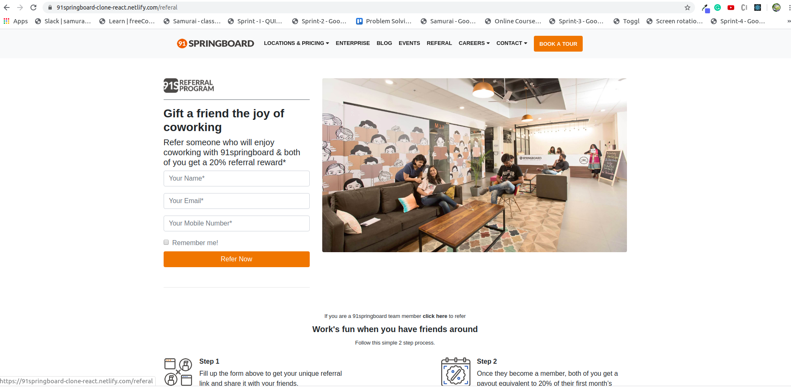

# springboard-clone-react

#### 91 SpringBoard Website clone (React,Routing,Bootstrap,CSS,HTML)

1.Initially the Project starts with the Landing page.
        

2.The Home page has a Navbar in its top which includes multiple items,where each item is connected from the Home page with the help of React Route. 

* Enterprise page:
         

* Blog page:
         

* Events page:
         
        
* Referal page:
         

